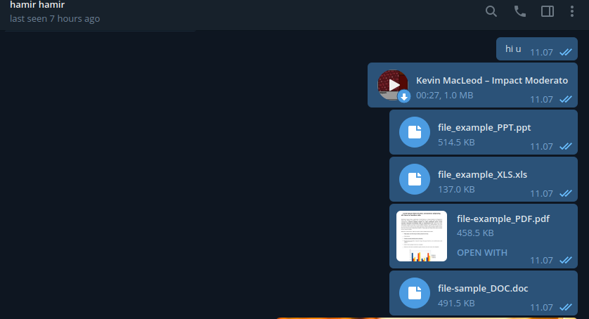

# python-access-telegram-user
fork from https://github.com/Hidayathamir

this is how to access telegram user, sent message, sent file (audio, document, photo, video), and schedule task.

python, telethon, access user, sent message, sent file, schedule task.
